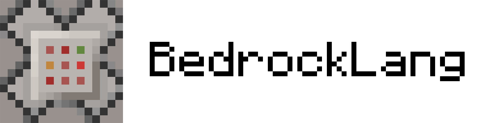

  

<h3 align="center">基岩版开发专用编程语言</h3>  

由BlocklyNukkit项目组开发
  

-----------  

# 什么是BedrockLang  

BedrockLang (简称BDL) 是为《我的世界：基岩版》专门设计的创意开发编程语言。  
BDL是简单、专一、强类型、高性能的，采取与mc命令类似的语法，对大部分mc原版命令直接兼容。

# 如何获取  

此项目正在处于开发中，尚未具备生产实践能力，感谢您关注本项目。 